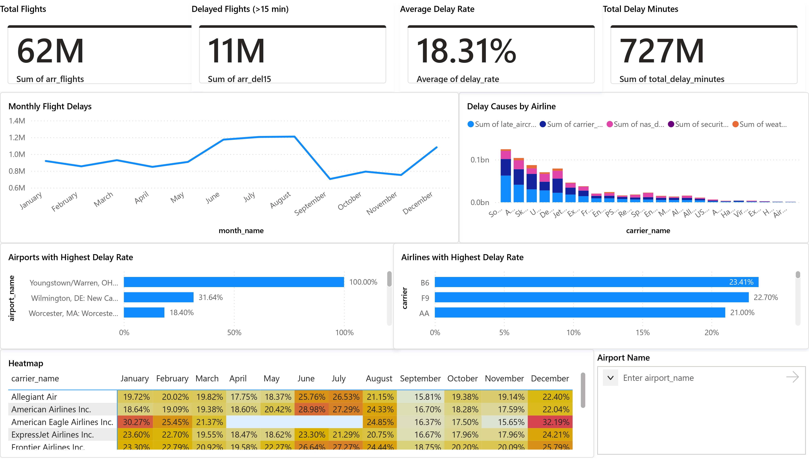

# Flight Delay Analytics Dashboard

An interactive airline delay analytics project built using Python data analysis and PowerBI visualization.

The project analyzes millions of flight records to uncover patterns in airline delays, delay causes, and airport performance.

## Project Overview

This project demonstrates how large aviation datasets can be analyzed and visualized to understand operational inefficiencies.

Key insights include:

• Airline delay comparisons  
• Airport delay performance  
• Monthly delay patterns  
• Delay causes across airlines  

The analysis pipeline combines Python data processing with an interactive PowerBI dashboard.

## Dataset

The dataset contains historical airline delay data including:

- Flight counts
- Delay durations
- Delay causes
- Airport statistics
- Monthly delay patterns

## Key Metrics

- Total Flights Analyzed: **62 Million**
- Delayed Flights (>15 minutes): **11 Million**
- Total Delay Minutes: **727 Million**
- Average Delay Rate: **18.31%**

## Tools & Technologies

Python  
Pandas  
NumPy  
Jupyter Notebook  
PowerBI  

## Dashboard Features

- Airline delay comparison
- Monthly delay trends
- Delay cause breakdown
- Airport delay rate analysis
- Interactive filtering

## Project Workflow

1. Data cleaning using Python
2. Exploratory data analysis
3. Feature preparation
4. PowerBI dashboard development
5. Visual insight extraction

## Screenshot

